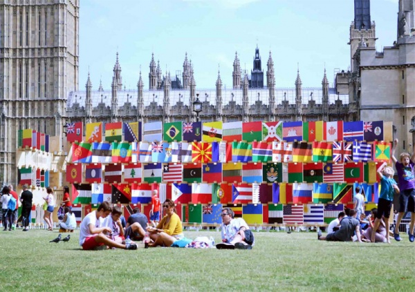
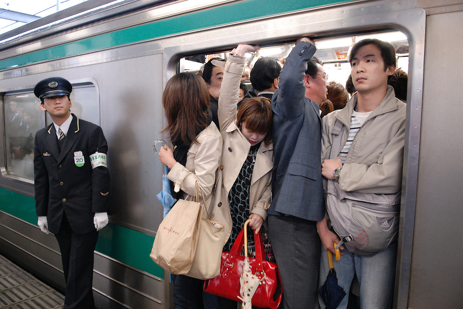

It has been a few weeks since my return back to the UK from Japan. I had come back about 9 months ago for about 10 days but because I was doing a lot of sight seeing and felt like a tourist, I really didn't feel like I was truly back. Now that I am back living and working in London I've come across the phenomenon of reverse culture shock.

<!-- more -->

Firstly though, what is [culture shock](http://www.oxforddictionaries.com/definition/english/culture-shock)? In the Oxford Dictionary, culture shock can be defined as this:

> The feeling of disorientation experienced by someone when they are suddenly subjected to an unfamiliar culture, way of life, or set of attitudes

I think some of us may have experienced this before when you have traveled to a foreign country and encounter or see things that are considered unfamiliar in the country you have spent the majority of your life in. Of course I had experienced culture shock when I moved to Japan. Even though I have grown quite accustomed to their cultures and attitudes, Japan still feels somewhat of a new world to me. Reverse culture shock is the opposite of that. Since I have been living in Japan for a number of years, culture in the UK  has become a bit unfamiliar to the point where I felt anxious at certain times. So here were some of the UK's norms I had to get used to again.

## Ethnic Diversity

One of the things that shocked me when I first went to Japan was the lack of cultural diversity. It seems odd to say this but I was surprised to see nothing but Japanese people in Japan. London is considered one of the [most diverse cities in the world](http://www.theguardian.com/uk/2005/jan/21/britishidentity1). For example, in 2011 only 44.1% of people in London are White British, 37% of the population were born outside the UK and over 300 languages are spoken in London. In Japan in 2011, 98.5% of the population is Japanese making it a very homogeneous culture. In Tokyo you do tend to see non-Japanese people but they seem to be mainly tourists but It is somewhat rare meet a lot of non-Japanese people who live and work in Japan. Although, after time I had gotten used to the homogeneous nature of Japan but after returning back to the UK, I felt overwhelmed by the sheer amount of different races I could see. Not even just seeing all the different races but hearing all the different languages. I went into to Uniqlo to buy a jumper but I heard Korean, Mandarin (or Cantonese, I can't tell!) and even the woman at the register accidentally spoke to me in Italian!

## Crossing Roads

Another behaviour that I had realised I had lost was the fact that I could not cross roads properly anymore. It does sound strange but in Japan they have the jaywalking law just like America. I do remember when I had started living in Japan I did not know the law about this at all and always wondered why are people waiting at the lights when there are no cars whatsoever. "Just cross!", I always thought to myself, so in typical British fashion I crossed the roads when there was a green light and got stared at. For any Japanese or American readers, there is no law such as [Jaywalking](http://www.bbc.co.uk/news/magazine-26073797) in the UK which means British people can cross wherever they like and not be penalised. From what I understand, Jaywalking was a term that first made an appearance in the 1910s. Jay means an inexperienced person and walk of course means to walk. This term was used by the motorway industry in the 1920s to keep pedestrians off the street. It wasn't taken seriously at first and then in the 1930s it became the norm. Just like America, Japan take jaywalking seriously. I have been stopped by the police because I have been jaywalking. After coming back to the UK, I honestly had forgotten how people recklessly cross the roads here to the point I was so reluctant to do so and waited for the lights to change. Not just that but even cars and buses gave a lot of leeway to pedestrians who were crossing the roads wherever they please.  Often so those pedestrians usually thanked drivers who had stopped for them with a gesture of waving. This never happens in Japan, but after a few weeks I was back to Jaywalking in London.

## Behaviour in Trains

One of the biggest changes I have noticed after living in Tokyo for two years is the train system. I believe many people have the image of the trains in Tokyo during rush hours being extremely crowded. Yes you're very correct! I think the worst line to ride on the tube in London (We call the subway the tube in London for your information) is the Central Line or the Northern Line. For the commuting Londoners out there, imagine 20 times that. That is rush hour in Tokyo on pretty much every line. Every morning whilst I was going to work in Tokyo, I've been crushed by other commuters so everyone can get to work on time. In the beginning, this was one of the most frustrating things about living in Tokyo. I really hated it to the point I wanted to argue with people who were pushing me. The amount of pushing that happens in Tokyo never happens in London. People who live in London seem to be very wary of their space when travelling on transportation. A lot of people will not even move up even if there is some kind of space just to avoid being in a crowded space. In Tokyo it is the opposite, I wouldn't say Japanese people like being in crowded space but they are patient enough it to deal with it just to let more people in and also to avoid being late as much as possible. Commuters aren't the only that push sometimes there is staff dedicated to help stuff bags into the carriages when they are blocking the doors. Maybe some readers have seen the [famous videos of commuters getting pushed by staff into trains](https://www.youtube.com/watch?v=b0A9-oUoMug). This I have never experienced at all whilst I have been there and I'm not too sure if they still exist. When I started to use the tube here, it was frustrating that I couldn't get on the train sometimes. I wanted to push my way on which would be the norm in Tokyo but in no way is that acceptable in London.

Hopefully you could see some of my predicaments after returning to my life back here in the UK. It's interesting how you adjust when you are in an environment you are not used to Although once you are used that foreign environment, it's not so simple to adjust back to what you have been accustomed to your whole life. I hope you enjoyed this post!
