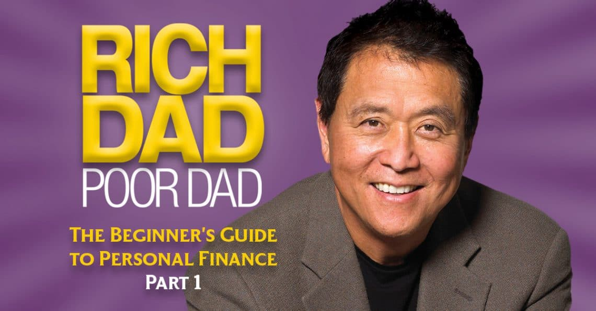

Rich Dad Poor Dad is the book that got me back into reading funnily enough. Reading about a subject I knew little but interact with every day really kept me engrossed in the book. Also it is written where it is very easy to follow and pretty much explained in laymen terms. I believe this book is for people who want to improve their financial situation but instead of jumping into a solution such stocks immediately this book teaches you how to view, value, make and keep money. Just to warn you there are couple of issues, since the book was written a while ago it doesn't reflect today's society completely such as crypto currency etc. Also since the author is American, some terms will only be relevant to American citizens unless there is an equivalent for you. Other than I think the overall message is very important for everyone to understand.

### Quotes

- If you can't make up your mind decisively, then you'll never learn to make money anyway. Opportunities come and go. Being able to know when to make quick decisions is an important skill. 

- Life pushes all of us around. Some people give up and others fight. A few learn the lesson and move on. They welcome life pushing them around. To these few people, it means they need and want to learn something. They learn and move on. Most quit, and a few like you fight.

- Emotions are what makes us human. The word 'emotion' stands for 'energy in motion.' Be truthful about your emotions and use your mind and emotions in your favour, not against yourself. 

- It's not how much money you make. It's how much money you keep.

- Intelligence solves problems and produces money. Money without financial intelligence is money soon gone.

- When I say mind your own business, I mean to build and keep your asset column strong. Once a dollar goes into it, never let it come out. Think of it this way: Once a dollar goes into your asset column, it becomes your employee. The best thing about money is that it works 24 hours a day and can work for generations. Keep your day job, be a great hardworking employee, but keep building that asset column.

- Financial IQ, or financial intelligence, is what makes that possible. It's made up of four things: accounting (financial literacy, or the ability to read numbers and evaluate the strengths and weaknesses of any business), investing (the science and strategies of money making money), understanding markets (the science of supply and demand, and market conditions), and the law (tax advantages and protection).

- If the opportunity is too complex and I do not understand the investment, I don't do it. Simple math and common sense are all you need to do well financially.

- The key to financial freedom and great wealth is a person's ability to convert earned income into passive and/or portfolio income.

